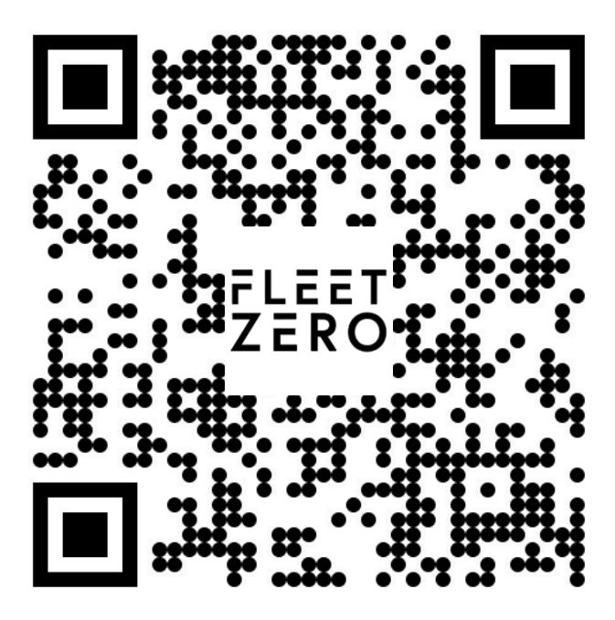
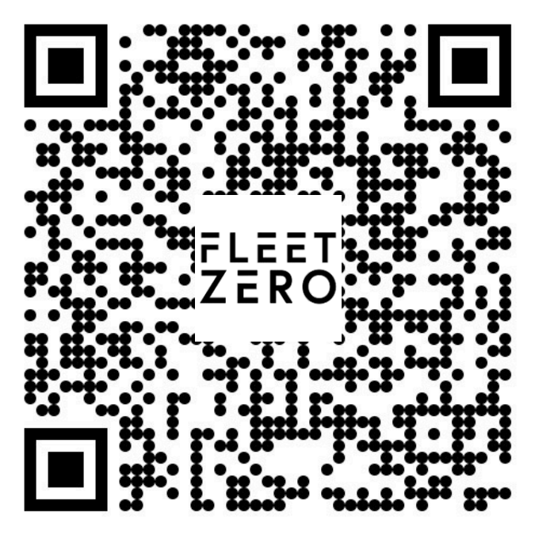

# 🚌 FleetZero Insight: Predictive Battery Intelligence

**🏆 1st Place – Transportation Innovation Jam 2025 (FleetZero Challenge)**  
Hosted by **FleetZero** and **Centennial College**  
📅 *Date:* October 24, 2025  

---

## 🚀 Overview
FleetZero Insight is a **predictive maintenance system** for electric bus fleets using **Digital Twin technology** and **AI-based analytics**.  
Our solution helps fleet operators predict battery degradation, optimize maintenance schedules, and reduce operating costs.

---

## ⚙️ Problem Statement
Battery failures in electric buses are costly and disruptive.  
- **Average cost per failure:** ≈ **$75,000**  
  ($65K replacement + $10K downtime)  
- Failures lead to service interruptions, maintenance inefficiencies, and lost service hours.

The challenge:  
> How can AI and digital twins predict these failures *before they happen*?

---

## 💡 Our Solution – *NextStop Predict*
**NextStop Predict** integrates real-time fleet data, digital twin simulation, and AI prediction models to forecast battery health and performance trends.

Real-Time Fleet Data → Digital Twin Simulation → AI Prediction & Insights

✅ Predicts failures **2–3 weeks in advance**  
✅ Reduces maintenance cost by **≈66.7%**  
✅ Extends battery lifespan by **20–25%**

---

## 🧠 Key Outcomes
| Metric | Result |
|--------|--------|
| Cost Reduction | ≈ **66.7%** |
| Electric Uptime | **92%** |
| CO₂ Saved per Month | **1.9 tons (projected)** |
| Prediction Lead Time | **2–3 weeks** |

---

## 📊 Dashboards
Two interactive dashboards were developed for the demo presentation (created by a teammate):

| Fleet Operator Dashboard | Individual Bus Intelligence |
|---------------------------|-----------------------------|
|  |  |

> **Dashboard credit:** Developed by Mac(teammate).  
> Scan the QR codes
> or use the demo links (https://frontend-hackathon-next-stop-station.onrender.com/driver-monitor)
> (https://frontend-hackathon-next-stop-station.onrender.com/) to explore.

---

## 🧩 System Architecture
Electric Bus Fleet
↓
Data Processing
↓
Digital Twin Engine
↓
Intelligent Agent
↓
AI Prediction Layer
↓
User Interface

Each layer enables real-time monitoring and predictive analytics for every vehicle in the fleet.

---

## 🧾 Presentation Slides
You can view the official presentation (submitted for judging) below:

📄 [FleetZero_Presentation.pdf](Presentation/FleetZero_Presentation.pdf)

*(PDF opens directly in GitHub preview.)*

---

## 🏁 Results & Recognition
🏆 **Winner – FleetZero Challenge, Transportation Innovation Jam 2025**  
Hosted by **FleetZero** and **Centennial College**.  
Our project was recognized for demonstrating how **AI-driven predictive maintenance** can achieve measurable cost savings and sustainability gains in public transit systems.

---

## 📂 Repository Structure
📁 /Presentation/ → Project presentation (PDF)
📁 /images/ → QR codes and visuals
📁 /docs/ → Additional documentation (to be added)
📄 README.md → Project overview (this file)

---

## 🙏 Credits
Developed by **Team NextStop Charge**  
Dashboard prototype created by Mac(teammate)
Special thanks to **FleetZero** and **Centennial College** for organizing the 2025 Transportation Innovation Jam.

---

### ✨ Keywords
`AI` · `Digital Twin` · `Predictive Maintenance` · `Smart Fleet` · `Transportation Innovation`  
